<div align="center">
<h1>TEC502 - Sistema de bancos distribuído</h1>
</div>


## Tópicos
- [Como executar?](#como-executar)
- [Organização do Projeto](#organização-do-projeto)
- [Banco](#banco)
  - [API REST](#api-rest)
    - [Gerenciamento de contas](#gerenciamento-de-contas)
    - [Token](#token)
    - [Transferências](#transferências)
    - [Autenticação](#autenticação)
  - [Comunicação entre os servidores](#comunicação-entre-os-servidores)
    - [Transferências](#transferências-1)
      - [Transação atômica](#transação-atômica)
    - [Sincronização](#sincronização)
  - [Concorrência distribuída](#concorrência-distribuída)
    - [Funcionamento teórico](#funcionamento-teórico)
      - [Confiabilidade](#confiabilidade)
    - [Funcionamento prático](#funcionamento-prático)
  - [Situação da transação concorrente](#situação-da-transação-concorrente)
- [Interface gráfica](#interface-gráfica)
  - [Autenticação](#autenticação)
    - [Registro](#registro)
    - [Login](#login)
  - [Transferência](#transferência)
- [Conclusão](#conclusão)


## Como executar?
1. Clone o repositório:
```bash
git clone https://github.com/MarcioDzn/TEC502-MI-REDES-02.git
```
### Banco
1. Navegue até o diretório do banco: 
```bash
cd TEC502-MI-REDES-02/api
```

2. Crie a imagem docker: 
```bash
docker build -t <nome_da_imagem> .
```
3. Execute o comando: 

```bash
docker container run -it -p 8080:8080 -e CURRENT_BANK=<indice_do_banco> -e BANKS=<ip_do_banco_0>::<ip_do_banco_1>::<ip_do_banco_n> <nome_da_imagem>
```

### Interface 
1. Navegue até o diretório principal:
```bash
cd TEC502-MI-REDES-02
```
2. Execute o comando: 
```bash
docker compose up client –build
```
3. Acesse a aplicação em [http://localhost:3000](http://localhost:3000)


## Organização do Projeto
O projeto é dividido em dois componentes principais:
- Banco (api)
    - Contém os arquivos referentes ao banco e suas funcionalidades, como criação de contas e transferências.
- Aplicação (interface)
    - Contém os arquivos referentes à interface gráfica, a qual permite ao usuário se registrar, efetuar login e realizar transferências.

## Banco
Os bancos realizam as funcionalidades principais do projeto, permitindo a criação de contas e a realização de transferências. Nesse sentido, o banco é uma API REST que pode se comunicar tanto com um cliente (interface) quanto com outros bancos por meio do protocolo HTTP.

### Arquitetura 
Os módulos principais utilizados no desenvolvimento do projeto são:
- `AccountDatabase`: Referente ao banco de dados responsável por armazenas as contas bancárias criadas;
- `AccountModel`: Referente ao modelo de informações para criação das contas bancárias;
- `TransferModel`: Referente ao modelo de informações relacionado às transferências;
- `UserDatabase`: Referente ao banco de dados responsável por armazenas os usuários criados;
- `UserModel`: Referente ao modelo de informações para criação dos usuários;
- `Token`: Referente às informações relacionadas ao token que circula na rede durante o funcionamento do sistema;
- `utils`: Referente à funções diversas do programa, como geração de id's e tokens de autenticação;
- `app`: Refernte à API do banco e à funções de manipulação do token na rede.

### AccountModel
As informações representadas pela classe `AccountModel` são:
- `_id`: Referente ao id de identificação exclusiva da conta;
- `account_type`: Referente ao tipo da conta, "normal" ou "conjunta";
- `users`: Lista de ids de usuários associados à conta;
- `password`: Senha da conta;
- `balance`: Saldo da conta;
- `blocked_transferred_balance`: Lista de transferências em andamento, representa o saldo bloqueado durante o processo;
- `transfer_history`: Lista de todas as transferências já realizadas ou que iniciaram mas foram interrompidas.

### UserModel
As informações representadas pela classe `UserModel` são:
- `_id`: Referente ao id de identificação exclusivo do usuário;
- `name`: Nome do usuário;
- `user_type`: Tipo de usuário, "pessoa física" ou "pessoa jurídica";
- `CPF`: CPF do usuário, preenchido apenas se for pessoa física;
- `CNPJ`: CNPJ do usuário, preenchido apenas se for pessoa jurídica.

### TransferModel
As informações representadas pela classe `TransferModel` são:

- `id`: Referente ao id de identificação da transferência;
- `operation_id`: Referente ao id de identificação da operação (grupo de transferências);
- `status`: Status da operação, "pending", "done" ou "error";
- `amount`: Quantidade sendo transferida;
- `source`: Agência de origem da transferência
- `account_source_id`: Conta de origem da transferência
- `destination`: Agência de destino da transferência
- `account_dest_id`: Conta de destino da transferência

### API REST
Para o desenvolvimento da API REST, utilizou-se o framework Flask, na linguagem de programação Python. 

O acesso à API se dá a partir do endereço base `http://<ip>:8080/v1/api/`, no qual o `<ip>` é o endereço ip da máquina executando o arquivo.

A API conta com diferentes rotas para variadas funcionalidades, tais como gerenciamento de contas, transferências bancárias e passagem do token pela rede.

#### Gerenciamento de contas
Uma importante funcionalidade da API é a criação e a busca de contas. Para tanto, as seguintes rotas são utilizadas:

##### POST /accounts
Rota responsável pela criação de uma conta bancária.

Corpo da requisição:
<div align="center">
  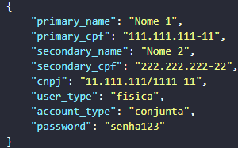
  <br/> <em>Figura 1. Corpo padrão da requisição para criação de uma nova conta.</em> <br/>
  <br/>
</div>

Resposta: 
<div align="center">
  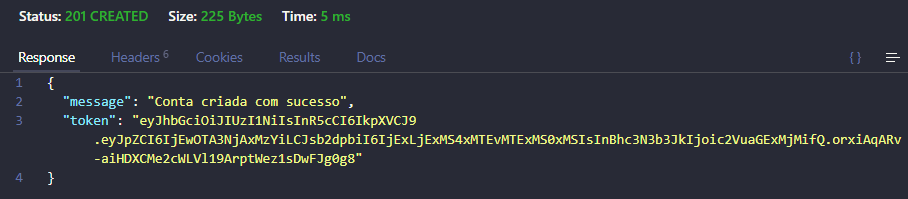
  <br/> <em>Figura 2. Resposta da requisição para criação de uma nova conta.</em> <br/>
  <br/>
</div>

> O campo `token` refere-se ao token de autenticação

##### GET /accounts
Rota responsável por retornar as contas criadas.

Resposta:
<div align="center">
  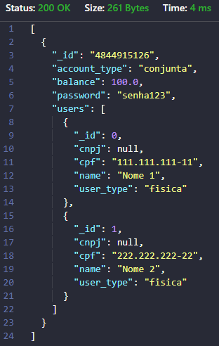
  <br/> <em>Figura 3. Resposta da requisição para busca de todas as contas.</em> <br/>
  <br/>
</div>

###### Parâmetros
É possível utilizar dois parâmetros para realizar a filtragem dos dados retornados, sendo eles:
- **cpf**: Permite que apenas as contas com um determinado CPF sejam retornadas
    - Exemplo: `/v1/api/accounts?cnpj=11.111.111/1111-11`
- **cnpj**: Permite que apenas as contas com um determinado CNPJ sejam retornadas
    - Exemplo: `/v1/api/accounts?cpf=111.111.111-11`

##### GET /accounts/:id
Rota responsável por retornar uma conta com um id em específico.

Resposta:
<div align="center">
  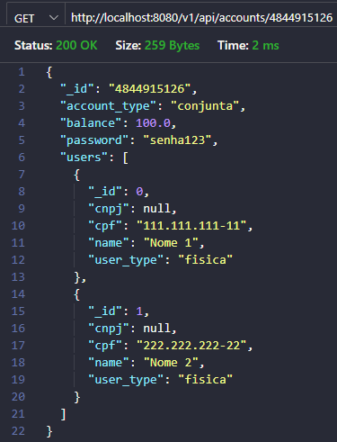
  <br/> <em>Figura 4. Resposta da requisição para busca de uma conta com id em específico.</em> <br/>
  <br/>
</div>

##### GET /accounts/all/:id
Rota responsável por retornar TODAS as contas de um usuário (de todos os bancos/APIs) com um determinado CPF ou CNPJ.

Resposta:
<div align="center">
  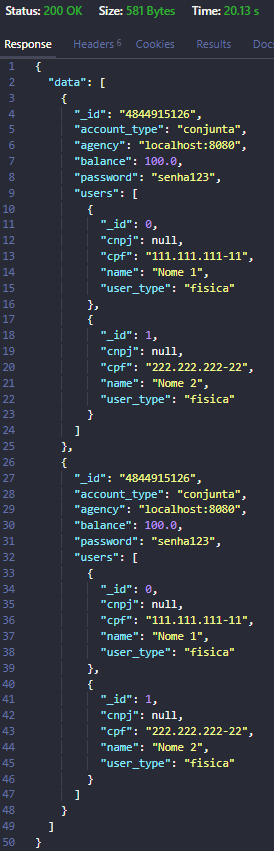
  <br/> <em>Figura 5. Resposta da requisição para busca de todas as contas de um usuário em específico.</em> <br/>
  <br/>
</div>

> Como podem ser feitas várias outras requisições dentro da requisição principal, o tempo de resposta pode ser alto.

#### Token
Para que o sistema funcione corretamente é necessário que um token especial circule entre as máquinas. Dessa forma, as rotas referentes a essa funcionalidade são:

##### GET /token
Rota responsável por retornar o status do token de uma determinada máquina. Esse endpoint é utilizado entre bancos, não havendo requisição direta do usuário final.

Respostas:
- Token presente na máquina
``` bash
STATUS: 200
    {
        "message": "active"
    }
```
- Token não presente na máquina
``` bash
STATUS: 200
    {
        "message": "undefined"
    }
```

##### POST /token
Rota responsável por passar o token de uma máquina a outra na rede. Também garante que tokens "inválidos" sejam descartados.

Corpo da requisição:
``` bash
    {
        "id": <id_atual_do_token>
    }
```

Respostas: 
- Token válido
``` bash
STATUS: 200
    {
        "message": "Token recebido com sucesso e alterado."
    }

```
- Token inválido
``` bash
STATUS: 200
    {
        "message": "Token recebido com sucesso mas não alterado (diferentes ids)."
    }

```

#### Transferências
A transferência de saldo entre diferentes contas é parte fundamental de um sistema bancário. Nesse sentido, o sistema contém rotas responsáveis por garantir a execução e a confiabilidade dessa operação.

##### PATCH /transfers
Responsável pela transferência atômica entre dois bancos, podendo realizar uma ou mais transações por vez.

Corpo da requisição:
<div align="center">
  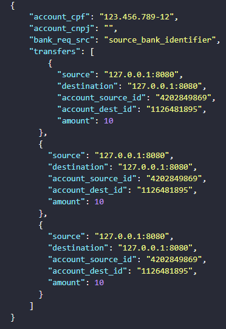
  <br/> <em>Figura 6. Corpo da requisição para uma transferência.</em> <br/>
  <br/>
</div>

Na figura 6, o campo `transfers` representa uma lista de transferências, onde cada elemento é o objeto:
```bash
    {
        "source": <agencia_de_origem>,
        "destination": <agencia_de_destino>,
        "account_source_id": <id_da_conta_de_origem>,
        "account_dest_id": <id_da_conta_de_destino>,
        "amount": <valor_a_ser_transferido>
    } 
```

Respostas:
- Transferência realizada com sucesso
<div align="center">
  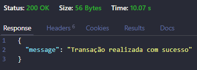
  <br/> <em>Figura 7. Sucesso durante uma transferência.</em> <br/>
  <br/>
</div>

- Erro durante a transferência

<div align="center">
  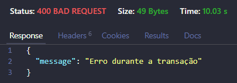
  <br/> <em>Figura 8. Erro durante uma transferência.</em> <br/>
  <br/>
</div>

##### PATCH /prepare
Rota responsável pela preparação das contas de origem e de destino durante uma transferência.

Corpo da requisição:
```bash
    {
      transfer_id: <id_da_transferência>
      operation_id: <id_da_operação>
      source: <agência_de_origem>
      destination: <agência_de_destino> 
      account_source_id: <id_da_conta_de_origem> 
      account_dest_id: <id_da_conta_de_destino> 
      account_cpf: <CPF_da_conta_de_origem>
      account_cnpj: <CNPJ_da_conta_de_origem>
      amount: <quantidade_a_ser_transferida>
      prepare_type: <tipo_de_preparação>
    } 
```

> O campo "prepare_type" indica se a conta sendo preparada é a de origem ou de destino, podendo ser "source" ou "destination", respectivamente.

Respostas: 
- Conta não encontrada

```bash
STATUS: 404
    {
      "message": "Conta não encontrada"
    } 
```

- CPF ou CNPJ inválidos

```bash
STATUS: 422
    {
      "message": "A conta não pertence ao usuário de CPF <CPF>"
    } 
```

- Saldo insuficiente

```bash
STATUS: 422
    {
      "message": "A conta não tem saldo suficiente para realizar a transação!"
    } 
```

- Preparação realizada com sucesso
```bash
STATUS: 200
    {
      "message": "Preparação realizada com sucesso"
    } 
```


##### PATCH /commit
Rota responsável pela transferência de saldo entre as contas de origem e de destin durante uma transferência.

Corpo da requisição:
```bash
    {
      transfer_id: <id_da_transferência> 
      operation_id: <id_da_operação>
      account_source_id: <id_da_conta_de_origem>
      account_dest_id: <id_da_conta_de_destino> 
      amount: <quantidade_a_ser_transferida> 
      commit_type: <tipo_de_commit> 
    } 
```

> O campo "commit_type" indica se a conta na fase de commit é a de origem ou de destino, podendo ser "source" ou "destination", respectivamente.

Respostas: 
- Conta não encontrada

```bash
STATUS: 404
    {
      "message": "Conta não encontrada"
    } 
```

- Commit realizado com sucesso
```bash
STATUS: 200
    {
      "message": "Commit realizado com sucesso"
    } 
```

##### PATCH /rollback FAZER FAZER FAZER
Rota responsável pela transferência de saldo entre as contas de origem e de destin durante uma transferência.

Corpo da requisição:
```bash
    {
      transfer_id: <id_da_transferência> 
      operation_id: <id_da_operação> 
      account_id: <id_da_conta_na_fase_de_rollback> 
      amount: <quantidade_a _ser_transferida> 
      rollback_type: <tipo_de_rollback> 
      action: <ação_executada_pelo_rollback> 
    } 
```

> O campo "rollback_type" indica se a conta na fase de rollback é a de origem ou de destino, podendo ser "source" ou "destination", respectivamente.

> O campo "action" indica qual ação será executada no rollback, podendo ser alteração de valores ou mudança no histórico de transferências, sendo "change_amount" ou "add_history", respectivamente. 

Respostas: 
- Conta não encontrada

```bash
STATUS: 404
    {
      "message": "Conta não encontrada"
    } 
```

- Commit realizado com sucesso
```bash
STATUS: 200
    {
      "message": "Reversão realizada com sucesso"
    } 
```

##### PATCH /receipts
Rota responsável por receber a quantidade passada durante uma transferência.

Corpo da requisição:
```bash
    {
      source: <agência_de_origem> 
      destination: <agência_de_destino> 
      account_source_id: <id_da_conta_de_origem> 
      account_dest_id: <id_da_conta_de_destino> 
      amount: <quantidade_a_ser_transferida> 
    } 
```

Respostas:
- Tipo de valor inválido 
```bash
STATUS: 400
    {
      "message": "Valor a ser transferido deve ser um número"
    } 
```

- Conta não encontrada
```bash
STATUS: 404
    {
      "message": "Conta não encontrada"
    } 
```

- Saldo recebido
```bash
STATUS: 200
    {
      "message": "Saldo recebido com sucesso!"
    } 
```

#### Autenticação
Para garantir a segurança do sistema, apenas usuários logados podem ter acesso a sua própria conta, dessa forma utilizou-se uma rota de autenticação.

##### POST /auth
Rota responsável por autenticar contas a partir de seu cpf ou cnpj, id da conta e senha. Retorna um token de autenticação criado com a biblioteca jwt (JSON Web Tokens).

Corpo da requisição:
<div align="center">
  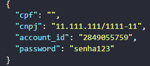
  <br/> <em>Figura 9. Corpo da requisição para autenticação.</em> <br/>
  <br/>
</div>

Respostas:
- Autenticado com sucesso
<div align="center">
  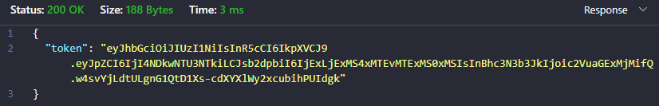
  <br/> <em>Figura 10. Resposta da requisição para autenticação em caso de sucesso.</em> <br/>
  <br/>
</div>

- Erro durante a autenticação
<div align="center">
  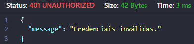
  <br/> <em>Figura 11. Resposta da requisição para autenticação em caso de erro.</em> <br/>
  <br/>
</div>

##### GET /auth/account
Rota responsável por retornar os dados da conta autenticada a partir de seu token de autenticação. 

O token deve ser passado através do campo Authorization, no header com a seguinte estrutura: `Bearer <token>`

Respost:
<div align="center">
  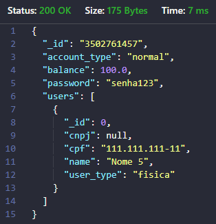
  <br/> <em>Figura 12. Resposta da requisição buscar a conta do usuário autenticado.</em> <br/>
  <br/>
</div>


### Comunicação entre os servidores
A comunicação entre os servidores se dá através de requisições HTTP, seja para realizar buscas ou transferências.

#### Transferências
Transferências bancárias são parte fundamental para o funcionamento do projeto em questão. Nesse sentido, é possível realizar transferências entre diferentes contas, sejam elas do mesmo banco, ou de bancos diferentes.

Ademais, o sistema permite ao usuário realizar tanto uma transferência unitária, quanto um conjunto de transferências por vez, que será chamado neste documento de operação. Para exemplificar, em uma mesma transação, um usuário com contas nos bancos A, B e C pode realizar transferências desses bancos para uma conta qualquer no banco D, de uma vez só.

##### Transação atômica
Devido ao caráter crítico das transferências em um sistema bancário, é de suma importância que quaisquer erros que venham a ocorrer durante esse processo sejam tratados adequadamente. Caso um problema ocorra, dados podem ficar inconsistentes, resultando em perdas ou ganhos monetários injustos.

Para garantir a confiabilidade dessa operação, utilizou-se o conceito de  **transação atômica**, a qual é uma operação que deve ser executada na íntegra, caso se tenha sucesso, ou seja interrompida por completo caso algum erro ocorra. 

O protocolo escolhido para implementar a transação atômica nesse sistema foi baseado no 2PC, ou *Two-Phase Commit Protocol*, um algoritmo distribuído entre processos interconectados, com algumas adaptações. Dessa forma, o protocolo empregado para a implementação de transações atômicas conta com três fases distintas: *prepare*, *commit* e *rollback*.

###### Prepare
A fase de *prepare* está relacionada a preparação dos bancos para que ocorra a transação.

Inicialmente verifica-se se é possível conectar-se ao banco onde se encontra a conta destinatária, e em caso positivo, examina-se se ela existe. 

Em seguida, verifica-se se é possível estabelecer uma conexão com o banco que contém a conta de origem da transação e se ela existe. Se essa conta estiver disponível, verifica-se se ela contém saldo suficiente para realizar a transação. Se o saldo disponível for satisfatório, ele é reservado para realizar a transferência.

###### Commit
A fase de *commit* ocorre após a de praparação, e representa a transferência em si dos valores alocados durante a fase anterior.

Durante essa etapa, o saldo necessário é de fato removido da conta de origem e depositado na conta de destino.

###### Rollback
A fase de *rollback* é responsável por refazer as transferências em caso de erro nas fases anteriores. Como a transação deve ser atômica, se houver algum erro, tudo que já foi realizado deve ser desfeito, a fim de garantir que não haja nenhuma inconsistência.

Dessa forma, suponha que uma operação com 3 transações esteja ocorrendo, e as duas primeiras tenham sido executadas com sucesso. Caso a terceira transação falhe, as duas transferências anteriores, mesmo que tenham sido realizadas com sucesso, são desfeitas, retirando dinheiro de quem recebeu, e devolvendo a quem "perdeu".

#### Sincronização 
Para garantir que duas operações que foram solicitadas ao mesmo tempo sejam executadas de maneira sincronizada e ordenada, fez-se necessário utilizar uma fila com o princípio FIFO, ou seja, o primeiro que entra é o primeiro que sai.

Dessa forma, sempre que uma nova operação, ou grupo de transferências, é requisitada, ela é armazenada em um dicionário de operações, que simula uma fila. Apenas a primeira operação dessa fila é executada, e quando é finalizada, seja com sucesso ou não, é removida do dicionário. A segunda operação então se torna a primeira e é executada assim como a anterior. O processo se repete até que todas as operações tenham sido finalizadas.

<div align="center">
  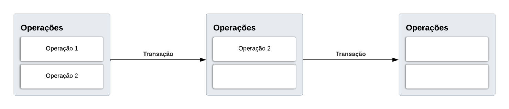
  <br/> <em>Figura 13. Exemplo de funcionamento da fila de transações.</em> <br/>
  <br/>
</div>

Como vários processos solicitando transferências podem tentar manipular a fila ao mesmo tempo, fez-se necessário adicionar *locks*. Dessa forma apenas um dos processos pode manipular o dicionário de operações por vez, impedindo que possíveis problemas de concorrência e inconsistência de dados ocorram.


### Concorrência distribuída 
A fim de evitar problemas relacionados à concorrência no sistema, empregou-se um algoritmo específico similar ao *Token Ring*. Tal algoritmo envolve a passagem de um "token" entre os nós participantes na rede, responsável por indicar quando uma máquina pode realizar suas tarefas pendentes. Assim, apenas um servidor pode realizar uma operação por vez, evitando comportamentos inesperados.

O token é representado por um objeto com dois atributos, um status, que indica se está ativo ou não na máquina e um id, um número inteiro utilizado em casos em que o token se perde. 

#### Funcionamento teórico
Quando o sistema inicia, apenas uma máquina deve possuir o token, tendo o status de seu objeto definido como "active", enquanto os demais nós apresentam status "undefined". Além disso, todas as máquinas setam o um id inicial para seu token, sendo ele `id = 0`.

<div align="center">
  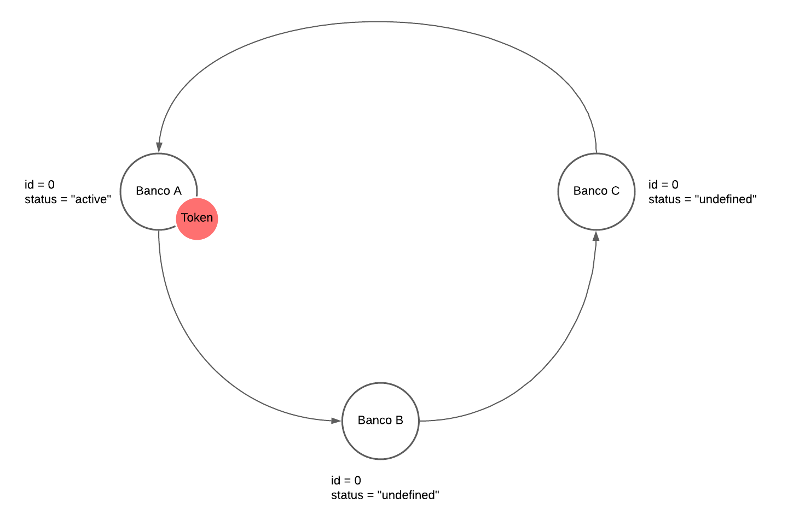
  <br/> <em>Figura 14. Disposição do token quando ocorre a inicialização do sistema.</em> <br/>
  <br/>
</div>

Sempre que um nó possui um token, ele deve ser passado para outra máquina em um certo perído de tempo, definido ou indefinido, a depender da situação. Caso nenhuma operação (conjunto de transferências) esteja sendo realizada, o token é passado para outro nó após 1 segundo desde sua chegada. Caso uma operação estiver sendo realizada, aguarda-se a sua finalização para que o token possa ser transferido.

A passagem de token de uma máquina a outra se dá por meio do protocolo HTTP, e é realizado na ordem dos itens do dicionário de bancos presente no nó. Quando o banco de indíce 0 está com o token ele tenta passar para o banco de índice 1 e assim por diante. 

<div align="center">
  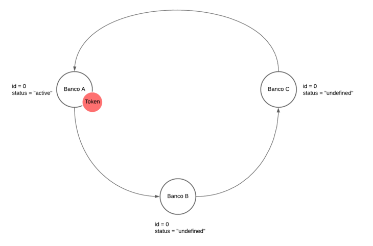
  <br/> <em>Figura 15. Passagem do token pela rede.</em> <br/>
  <br/>
</div>

Também existe a possibilidade de que mesmo disponível, um banco não possa receber um token. Tal situação ocorre quando o id do token sendo enviado é **menor** que o id do token que o banco receptor armazena, significando que este token é inválido, sendo descartado da rede.

Quando uma máquina toma posse de um token ela é livre para realizar suas tarefas, no caso transferências bancárias. Entretanto, outras ações, como criação e busca de contas, autenticação, etc. não dependem da presença do token, podendo ser realizadas livremente.

##### Confiabilidade
Para que tudo funcione da maneira esperada, fez-se necessário garantir que mesmo em situações adversas, como a queda da conexão de um ou mais nós, o sistema continue ativo. Dessa forma, duas situações em especial podem ocorrer, sendo elas a queda de um nó que não possui o token e a queda de um nó que possui o token. 

###### Máquina sem o token caiu
Nessa situação, quando um nó tentar se comunicar com a máquina que caiu, não haverá conexão, não sendo possível passar o token. A máquina que quer repassar o token então busca na lista de bancos o banco seguinte ao desconectado, e tenta conectar-se a ele. 

Em suma, o nó que quer repassar o token buscará sempre um nó disponível para transmiti-lo, pulando aqueles que não se encontram online.

Ademais, os servidores que permaneceram conectados **continuarão funcionando e se comunicando normalmente** entre si.

<div align="center">
  
  <br/> <em>Figura 16. Máquina sem o token caiu.</em> <br/>
  <br/>
</div>

###### Máquina com o token caiu
Caso uma máquina que esteja em posse do token perca conexão com a rede, os demais nós não poderão realizar nenhuma transferência, pois o token deixou de circular entre os participantes conectados.

Nessa situação, um novo token deve ser gerado, a fim de que o sistema possa voltar a funcionar. Para que isso ocorra, fez-se necessário implementar um mecanismo de recuperação, que identifica quando o token deixou de circular e gera um novo.

Nesse sentido, cada máquina possui um *timer*, que conta o tempo que um determinado nó está sem o token. Dessa forma, sempre que um banco passa o token, o contador começa a funcionar, sendo zerado quando o token volta a esse nó. Caso o token não retorne a essa máquina depois de um certo tempo *t* identifica-se que o mesmo deixou de circular na rede, tornando-se necessário originar um novo. O tempo *t* depende da quantidade de máquinas disponíveis na rede, sendo: $$ t = (\text{número de máquinas online}) \times 3 $$.

A máquina que atingiu o tempo limite gera o token e envia uma mensagem para todos os outros nós ativos da rede, informando que um novo token foi criado. A partir desse momento, o contador dos nós remanescentes é zerado, a fim de que nenhum outro token seja originado, o que poderia resultar em multiplos tokens na rede.

A mensagem supracitada também contém o novo id do token criado, que é `o id antigo + 1`. Dessa forma, todos os nós *online*, incluindo o que gerou o *token*, passam a ter seu id de token atualizado.

<div align="center">
  
  <br/> <em>Figura 17. Máquina com o token caiu.</em> <br/>
  <br/>
</div>


A atualização do id é importante pois caso o nó que caiu com o token retorne, ele tentará enviar seu próprio token, desatualizado, pela rede, o que poderia gerar tokens duplicados. Como o token desse nó possui um id antigo, ele é descartado pelo nó seguinte, que possui um id de token maior, o identificando como inválido.

Em resumo, quando uma máquina com um token cai, **nenhuma outra máquina pode realizar transferências até que um novo token seja gerado**. Quando um novo token é originado, o sistema passa a funcionar normalmente, com exceção da máquina que caiu. Além disso, quando o nó com o token antigo retorna à rede, isso não é um problema, já que ele é descartado e eventualmente substituído pelo token atualizado.

<div align="center">
  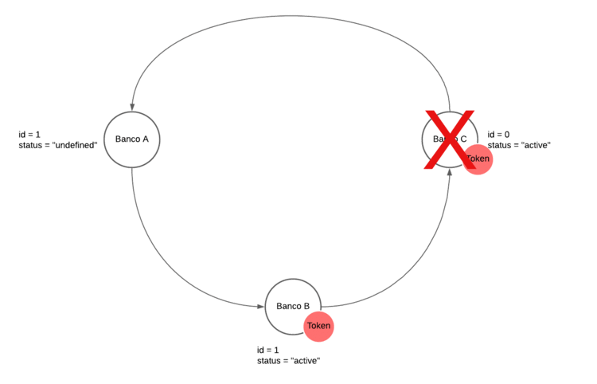
  <br/> <em>Figura 18. Máquina com o token que caiu retornou.</em> <br/>
  <br/>
</div>

#### Funcionamento prático
A execução prática do algoritmo de passagem de token supracitado funciona como o esperado, permitindo que apenas os nós com o token realizem operações críticas (transferências). 

Além disso, situações adversas, como a queda de um nó, não representam o fim do sistema, sendo tratadas adequadamente. Assim, um novo token é gerado quando o atual se perde e em nenhum momento dois tokens circulam na rede ao mesmo tempo.

### Situação da transação concorrente

## Interface gráfica
A fim de permitir que o usuário realize transferências, desenvolveu-se uma interface gráfica utilizando o *framework* ReactJS.

A partir da interface é possível:
- Cadastrar uma nova conta
- Logar em um conta já existente
- Realizar transferências bancárias entre diferentes contas

### Autenticação
Para poder realizar transferências o usuário precisa primeiro ter uma conta, portanto, é necessário que o mesmo crie uma, podendo acessá-la posteriormente.

#### Registro
A tela de registro pode ser acessada por meio da URL `http://localhost:3000/register`.

Nessa página é possível criar uma conta a partir das seguintes informações:
- Tipo de conta (normal ou conjunta)
- Tipo de usuário (pessoa física ou pessoa jurídica)
- Nome
- CPF (pessoa física)
- CNPJ (pessoa jurídica)
- Agência (ip da máquina executando o servidor do banco)
- Senha

<div align="center">
  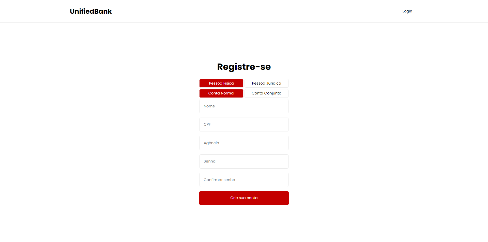
  <br/> <em>Figura 19. Página de registro.</em> <br/>
  <br/>
</div>

> Caso o usuário deseje criar uma conta conjunta, dois nomes e dois CPFs deverão ser informados.

#### Login
Já a página de login, acessada a partir da URL `http://localhost:3000/login` permite a um usuário entrar em uma conta que já foi cadastrada, a partir dos seguintes dados:

- CPF (pessoa física)
- CNPJ (pessoa jurídica)
- Número da conta
- Agência
- Senha

<div align="center">
  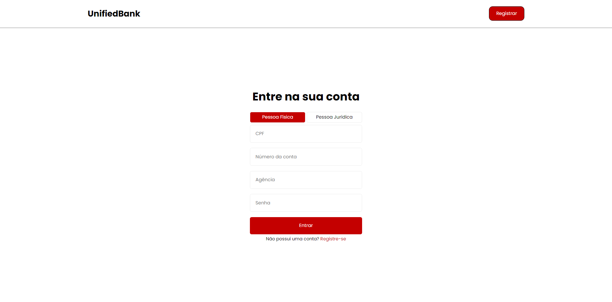
  <br/> <em>Figura 20. Página de login.</em> <br/>
  <br/>
</div>

### Página inicial
A página inicial pode ser acessada a partir da rota `http://localhost:3000/app`.

Tal página mostra informações do usuário logado no momento, bem como suas contas em outros bancos. 

Ademais, no canto inferior direito é possível visualizar as transferências pendentes. Caso não haja nenhuma, um botão é disponibilizado para que o usuário as insira. 

<div align="center">
  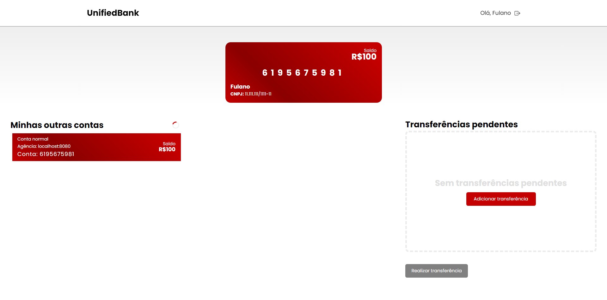
  <br/> <em>Figura 21. Página principal.</em> <br/>
  <br/>
</div>

### Transferência
Caso um usuário deseje realizar uma ou mais transferências, o mesmo deve clicar no botão de `Adicionar Transferência`. Um modal será exibido, permitindo que sejam inseridas as seguintes informações:
- Conta e agência de origem
- Conta e agência de destino
- Valor a ser transferido

> A conta e agência de origem são limitadas às pertencentes ao usuário.
<div align="center">
  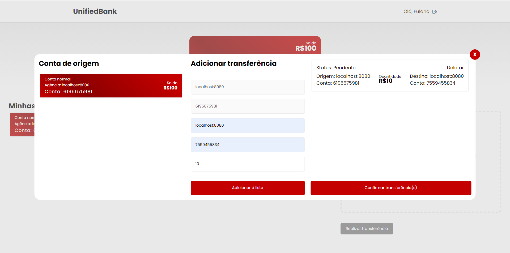
  <br/> <em>Figura 22. Modal de adicionar transferência.</em> <br/>
  <br/>
</div>

Ao fim da adição de informações o usuário deve clicar em `Confirmar Transferência(s)`, fechando automaticamente o modal. Após isso, para realizar de fato a(s) transferência(s), o usuário deve pressionar o botão `Realizar Transferência`.

## Conclusão
O sistema cumpre com todos os requisitos definidos, sendo capaz de realizar transações atômicas sobre o dinheiro em contas de outro banco, envolvendo uma ou mais contas. Ademais, a comunicação entre os bancos e com os usuários finais foi feita utilizando o protocolo HTTP, através de uma API REST. Além disso, implementações contra possíveis problemas de concorrência foram desenvolvidas, como um algoritmo de passagem de token, evitando problemas indesejados.

Por fim, a execução do sistema em diversas máquinas e ambientes se dá através da ferramenta *Docker*.


